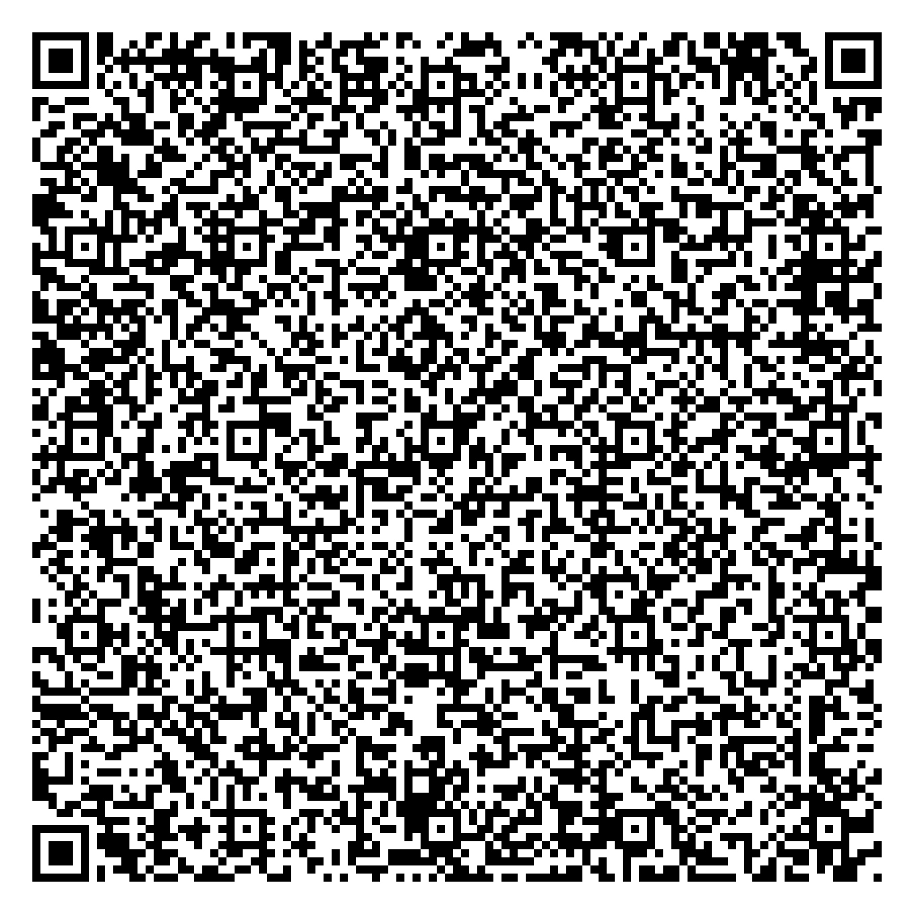

[](pricer.html)

# qrscholes

Black-Scholes options pricer inside a QR code.

Scan it. Your phone opens a working pricer -- no app, no server, no install.

## How it works

The entire pricer is a self-contained HTML page (731 bytes). It fits inside a QR code as a `data:text/html;base64,` URL. When scanned, the browser decodes and renders it locally.

```
pricer.html  -->  base64  -->  data URL  -->  QR code
731 bytes         976 chars     998 chars      version 22
```

Implements the Black-Scholes formula with the Abramowitz and Stegun erf approximation (max error 1.5e-7).

## Parameters

| Input | Meaning |
|-------|---------|
| S | Spot price |
| K | Strike price |
| r | Risk-free rate (annualized) |
| T | Time to expiry (years) |
| v | Implied volatility (annualized) |

## Accuracy check

S=100, K=100, r=0.05, T=1, v=0.20:
- Call: $10.4506 (matches closed-form to 4 decimal places)
- Put: $5.5735
- Put-call parity: holds to <0.001

## Try it

Scan the QR code above, or open `pricer.html` directly.

---

by [Saksham Arora](https://github.com/saksham10arora-dotcom)
